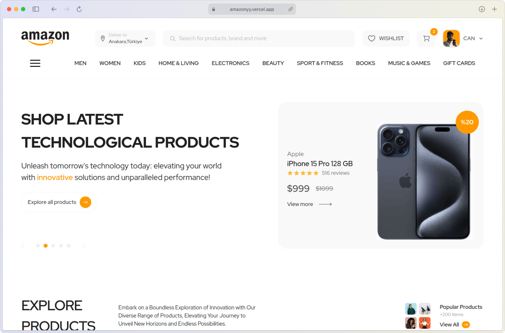

# Amazonyy - A Bold Redesign

## Overview

This project is a redesign of the well-known e-commerce platform, Amazon. The goal was to enhance the user experience and modernize the visual aesthetics of the website, while maintaining the core functionality that users have come to know and love.

## Preview

## Design

The initial design for this project was sourced from the Figma community. Some edits were made to the original Figma file to make it development-ready.

* My rework: [ABHAY's File](https://www.figma.com/design/wCDqLu6pLcPXO9v43HE7lg/Amazon-Redesign?node-id=1-16&t=J0utj7KOOBjmLlTB-0)
* Original Design: [Can Yılmaz's File](https://www.figma.com/community/file/1303739489831957570)

## Build With

 

**Thanks for peepin', happy shoppin'! ✨**
